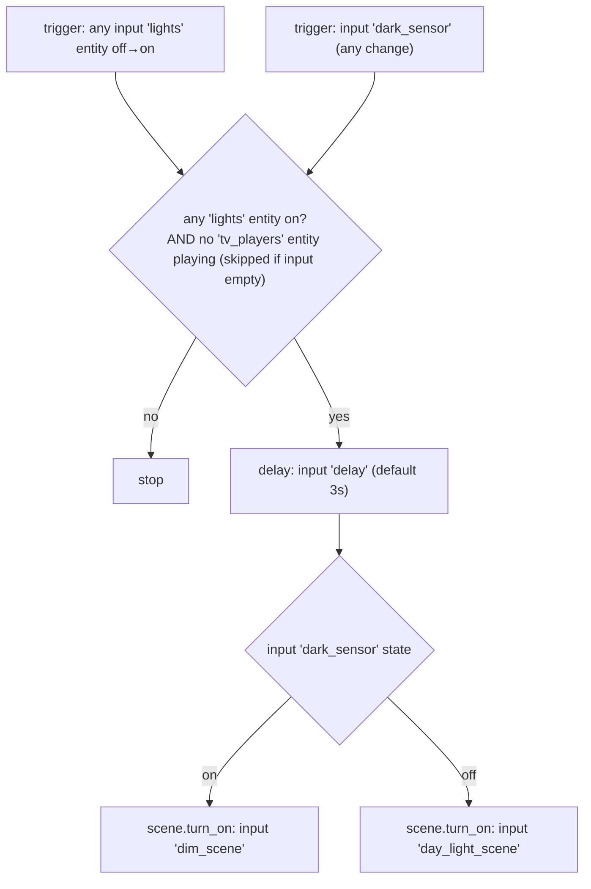
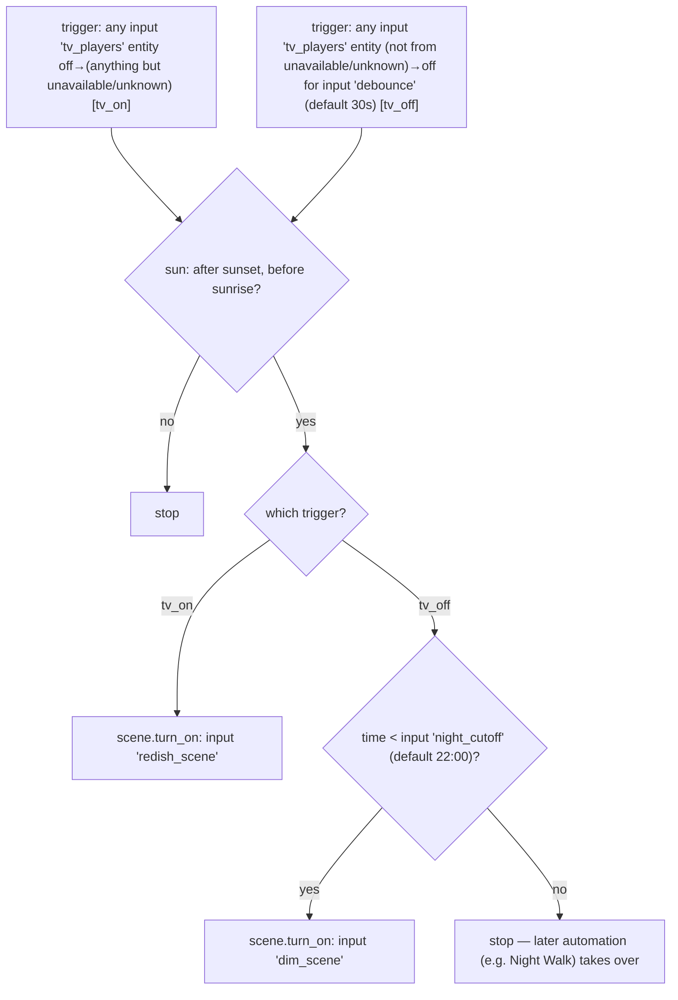

# Automation Flow Reference

One file per `packages/*.yaml` automation, each with a Mermaid flowchart of
its trigger → condition → action flow and a caveats/recommendations section.

Hand-written, not generated — re-check against the package YAML if an
automation changes.

## Auto Scene blueprint

LR, MB, Kitchen, and Abi's `*: Auto Scene` automations are all instances of
[`blueprints/automation/terminus/auto_scene.yaml`](../../blueprints/automation/terminus/auto_scene.yaml)
rather than separate hand-written automations. Each package just supplies
inputs:

| Room | `lights` | `dark_sensor` | `tv_players` |
|---|---|---|---|
| LR | `lr_living`, `lr_dining` | `lr_is_dark` | `lr_tv`, `lr_tv_hub_cast` |
| MB | `mb_led_one`, `mb_led_two` | `mb_is_dark` | `mb_tv` |
| Kitchen | `kitchen_lobby/counter/led_one/led_two` | `kitchen_is_dark` (shares `lr`'s lux input) | — (none) |
| Abi | `abi_led_one`, `abi_led_two` | `abi_is_dark` (shares `mb`'s lux input) | — (none) |

## TV Scene blueprint

LR and MB's `*: TV Scene` automations are both instances of
[`blueprints/automation/terminus/tv_scene.yaml`](../../blueprints/automation/terminus/tv_scene.yaml)
rather than separate hand-written automations. Each package just supplies
inputs:

| Room | `tv_players` | `redish_scene` | `dim_scene` |
|---|---|---|---|
| LR | `lr_tv`, `lr_tv_hub_cast` | `lr_redish` | `lr_dim` |
| MB | `mb_tv` | `mb_redish` | `mb_dim` |

Both rooms use the blueprint's `night_cutoff` (`22:00:00`) and `debounce`
(`30`s) defaults — neither package overrides them. The `not_from`/`not_to`
`unavailable`/`unknown` guards on both triggers are fixed by the blueprint
body, not an input, so every instance gets them automatically.

## Shared `is_dark` macro

All four `is_dark` sensors — `lr_is_dark`, `mb_is_dark`, `kitchen_is_dark`,
`abi_is_dark` — are template `binary_sensor`s in
[`light_sensing.yaml`](../../packages/light_sensing.yaml) built on one
shared hysteresis macro, `lux_is_dark`, defined in
[`custom_templates/is_dark.jinja`](../../custom_templates/is_dark.jinja)
and pulled in via ``. Kitchen/Abi
call the macro with LR's/MB's illuminance sensor as input (they have none
of their own) but their *own* entity as the hysteresis memory, so each
computes its own on/off independently rather than mirroring the other
room's computed output — same formula, same input reading, one shared
implementation. Swapping in a real per-room sensor later is a one-line
change to that `states(...)` argument, no automation edits needed.

Note: Home Assistant's `custom_templates/*.jinja` loader is a Jinja
`BaseLoader`, not a global-function injector — macros defined there are
**not** auto-available in every template. Each template that wants
`lux_is_dark` must explicitly ``
first (verified against a real HA instance — omitting the import renders
`'lux_is_dark' is undefined` and the entity goes `unavailable`, both on
cold boot and after `homeassistant.reload_custom_templates` /
`template.reload`).

The `tv_players` guard is implemented as a template
(`selectattr('state', 'eq', 'playing') | list | length == 0`) so an empty
list — Kitchen and Abi's case — trivially passes, unifying the "has a TV"
and "has no TV" rooms under one blueprint without a separate code path.

| File | Package |
|---|---|
| [illuminance.md](illuminance.md) | `packages/illuminance.yaml` |
| [living_room.md](living_room.md) | `packages/living_room.yaml` |
| [master_bedroom.md](master_bedroom.md) | `packages/master_bedroom.yaml` |
| [kitchen.md](kitchen.md) | `packages/kitchen.yaml` |
| [abi.md](abi.md) | `packages/abi.yaml` |
| [schedule.md](schedule.md) | `packages/schedule.yaml` |
| [presence.md](presence.md) | `packages/presence.yaml` |
| [night_walk.md](night_walk.md) | `packages/night_walk.yaml` |
| [notifications.md](notifications.md) | `packages/notifications.yaml` |

## Cross-automation conflicts

Found by cross-referencing trigger entities, action targets, and the live
label registry (`light`/`socket`/`lamp`) across all 21 automations above.

1. **`schedule.yaml`'s 22:00 shutoff can kill an active TV scene.** "Turn off
   the lights at 10pm" force-turns-off every `light`-labeled entity —
   including `lr_living`, `lr_dining`, `mb_led_one`/`mb_led_two` — with no
   TV-playing guard. [`LR: TV Scene`](living_room.md#lr-tv-scene) /
   [`MB: TV Scene`](master_bedroom.md#mb-tv-scene) apply Redish while the TV
   plays, gated only to "between sunset and sunrise" — which includes
   22:00. If the TV is playing at exactly 22:00:00, the fixed schedule
   automation forces those same lights off regardless of playback state.
   [`LR: Auto Scene`](living_room.md#lr-auto-scene) /
   [`MB: Auto Scene`](master_bedroom.md#mb-auto-scene) both added a
   "not TV playing" guard for exactly this reason — the 22:00 schedule
   never got the same treatment.
2. **Same gap in the "leave" presence automation.**
   ["Turn off lights when everyone leaves"](presence.md) also force-turns-off
   `light`-labeled entities with no TV-playing guard. Lower probability
   (needs the TV playing while every tracked phone is away) but the same
   category of gap as #1.
3. **Scene targets are shared by two automations each, coordinated only by
   conditions — not a lock.** `scene.lr_dim`/`scene.mb_dim` (and the
   day_light/redish variants) are each written by both that room's
   `Auto Scene` and `TV Scene` automation. They avoid colliding today only
   because of conditions (`not TV playing`, the sun window, the
   `time < 22:00` dim branch) — there's no actual mutual exclusion. Loosening
   any one of those guards in a future edit could reintroduce a race where
   both scenes fire back-to-back. `Auto Scene`'s half of that guard now
   lives once in the shared
   [Auto Scene blueprint](README.md#auto-scene-blueprint) (the `tv_players`
   input) rather than duplicated per room — a fix there fixes it everywhere,
   but a bug there also breaks it everywhere; `TV Scene`'s half is still
   separate hand-written logic per room, so the two are not symmetrically
   guarded even now.
4. **Illuminance Control and Night Walk own the same lamp/socket switches
   on disjoint clocks, leaving a blind gap.** Each
   [Illuminance Switch Control](illuminance.md#illuminance-switch-control-blueprint)
   instance drives its own switch (`lr_lamp_socket`, `mb_lamp_socket`,
   `abi_desk_lamp_socket`, `yard_string_lights_socket`) only during
   06:00–22:00. [`Night Walk`](night_walk.md) reactively drives
   `switch.lr_lamp_socket` only during 00:00–05:00 (triggered by the
   abi/mb socket switches changing). **05:00–06:00 has no owner** for any
   of these switches — if it's dark and someone's up early, nothing
   responds to darkness or presence until 06:00.
5. **Cosmetic, not functional: Night Walk changes the `switch.sockets`
   group's aggregate state as a side effect.** Turning on
   `abi_desk_lamp_socket` / `mb_lamp_socket` at 2am also flips the
   `switch.sockets` group entity's state (a `platform: group` aggregate
   kept around for the manual `scene.sockets_off` convenience scene), even
   though none of the per-switch Illuminance Control instances are active
   at night. No automation reads that group state as a condition, so
   nothing breaks functionally — just confusing if you inspect
   `switch.sockets` state during Night Walk hours and wonder why it's "on"
   outside the 06:00–22:00 window.
