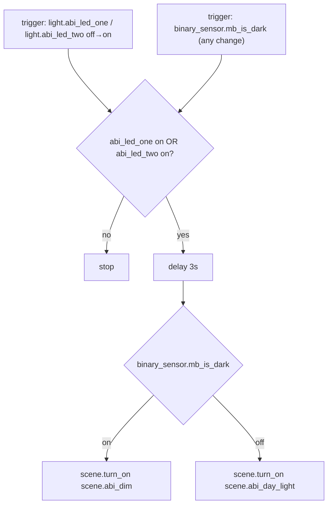

# Abi — Automations

Source: [`packages/abi.yaml`](../../packages/abi.yaml)

## Abi: Auto Scene

Same pattern as Kitchen's Auto Scene, applied to `light.abi_led_one` /
`light.abi_led_two`, sharing MB's lux sensor (`binary_sensor.mb_is_dark`)
since Abi has no illuminance sensor of its own.

Instance of the [Auto Scene blueprint](README.md#auto-scene-blueprint),
with `tv_players` left empty (Abi has no TV) — `packages/abi.yaml` only
supplies inputs, not the automation logic.

### Caveats / recommendations

- **Borrows MB's lux sensor**, same coupling caveat as
  [Kitchen borrowing LR's sensor](kitchen.md#kitchen-auto-scene) — Abi's
  actual light level isn't measured; it inherits MB's `is_dark` state.
- **`light.abi_pixoo_light` is intentionally excluded** from both this
  automation and the Abi scenes — it only supports `brightness` (no
  `color_temp`/`hs_color`), so it can't represent Day Light / Dim / Redish /
  Bluish the way the two LED lights can. If Abi's Pixoo panel should track
  ambient brightness too, it needs separate handling (e.g. a
  brightness-only companion action), not inclusion in these scenes.
- **No TV Scene equivalent** — Abi has no `media_player`.
- Same 3s-delay / undebounced-`is_dark` notes as
  [`LR: Auto Scene`](living_room.md#lr-auto-scene) apply here.
