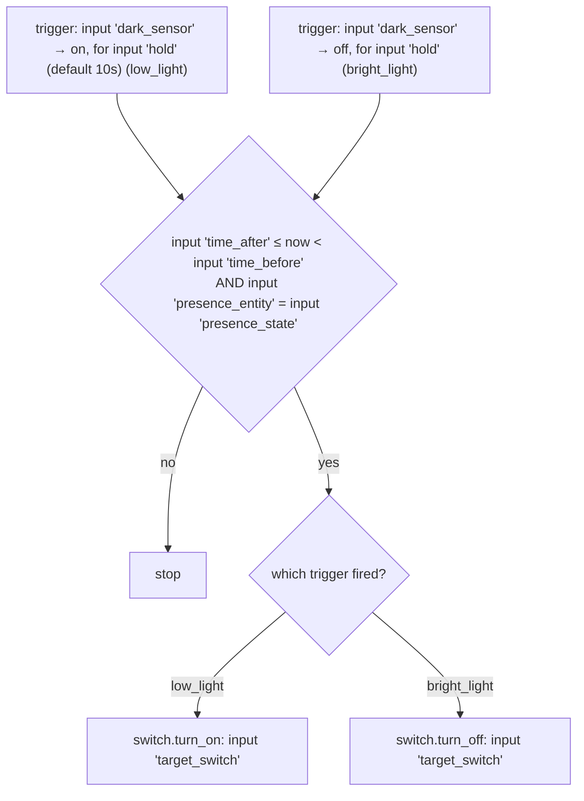

# Illuminance — Automations

Source: [`packages/illuminance.yaml`](../../packages/illuminance.yaml)

## Illuminance Switch Control blueprint

`LR: Illuminance Control`, `MB: Illuminance Control`, `Abi: Illuminance
Control`, and `Yard: Illuminance Control` are all instances of
[`blueprints/automation/terminus/illuminance_switch_control.yaml`](../../blueprints/automation/terminus/illuminance_switch_control.yaml)
rather than one automation driving the whole `switch.sockets` group off a
single sensor (the previous design). Each instance gates one switch off one
darkness sensor:

| Instance | `dark_sensor` | `target_switch` | `time_after`/`time_before` | `presence_entity`/`presence_state` |
|---|---|---|---|---|
| LR | `lr_is_dark` | `lr_lamp_socket` | `06:00:00`–`22:00:00` (default) | `group.family_trackers` = `home` (default) |
| MB | `mb_is_dark` | `mb_lamp_socket` | default | default |
| Abi | `abi_is_dark` | `abi_desk_lamp_socket` | default | default |
| Yard | `lr_is_dark` (shared — see caveats) | `yard_string_lights_socket` | default | default |

The `switch.sockets` group entity (`platform: group` over all four
switches) still exists for the manual `scene.sockets_off` convenience
scene, but as of this split no automation writes to the group directly —
each instance targets its own member switch.

### Caveats

- **Yard still shares LR's sensor.** Yard has no illuminance sensor of its
  own, so its instance reuses `binary_sensor.lr_is_dark` — same behavior as
  before this automation was split per room. If LR's light level diverges
  from the yard's (e.g. LR is indoors, Yard is outdoors — likely to diverge
  often), Yard's socket follows LR's reading, not its own.
- **No action outside 06:00–22:00** for any instance. After 22:00 sockets
  won't auto-turn-on even if dark — by design,
  [`schedule.yaml`](../../packages/schedule.yaml)'s 10pm shutoff and
  [`night_walk.yaml`](../../packages/night_walk.yaml) own the late-night
  behavior instead. Worth remembering if any instance ever seems
  "unresponsive" late at night.
- **Family-away means no response to darkness at all**, even during the
  06:00–22:00 window — the gated switch stays in whatever state it was left
  in. This is now per-instance rather than shared, but the behavior is
  unchanged from before the split.

### Recommendations

- Add a dedicated Yard illuminance sensor to remove the LR-borrowing above
  — swapping it in is a one-line change to the `dark_sensor` input on the
  Yard instance in `packages/illuminance.yaml`, no blueprint edits needed.
