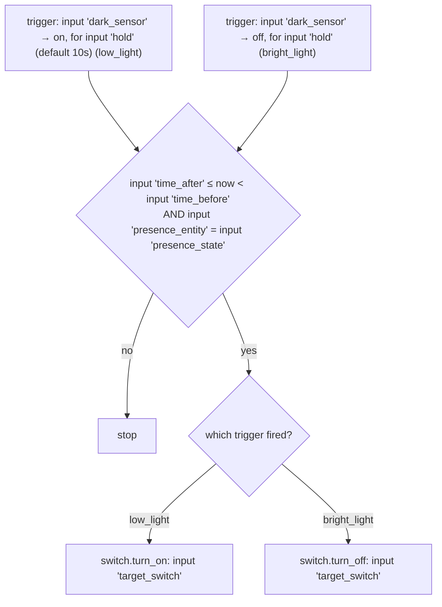

# Illuminance — Automations

Source: [`packages/illuminance.yaml`](../../packages/illuminance.yaml)

## Illuminance Switch Control blueprint

`LR: Illuminance Control`, `MB: Illuminance Control`, `Abi: Illuminance
Control`, and `Yard: Illuminance Control` are all instances of
[`blueprints/automation/terminus/illuminance_switch_control.yaml`](../../blueprints/automation/terminus/illuminance_switch_control.yaml)
rather than one automation driving the whole `switch.sockets` group off a
single sensor (the previous design). Each instance gates one switch off one
darkness sensor:

| Instance | `dark_sensor` | `target_switch` | `time_after`/`time_before` | `presence_entity`/`presence_state` |
|---|---|---|---|---|
| LR | `lr_is_dark` | `lr_lamp_socket` | `06:00:00`–`22:00:00` (default) | `group.family_trackers` = `home` (default) |
| MB | `mb_is_dark` | `mb_lamp_socket` | default | default |
| Abi | `abi_is_dark` | `abi_desk_lamp_socket` | default | default |
| Yard | `yard_is_dark` (pure sun elevation — see caveats) | `yard_string_lights_socket` | default | default |

The `switch.sockets` group entity (`platform: group` over all four
switches) still exists for the manual `scene.sockets_off` convenience
scene, but as of this split no automation writes to the group directly —
each instance targets its own member switch.

### Caveats

- **`binary_sensor.yard_is_dark` is pure sun elevation, not a lux
  reading.** Defined in
  [`light_sensing.yaml`](../../packages/light_sensing.yaml) as
  `{{ is_state('sun.sun', 'below_horizon') }}` — no hysteresis band, no
  macro, because sun elevation doesn't flicker the way lux does; it crosses
  the horizon exactly twice a day. This means it flips at exact
  sunset/sunrise (elevation = 0°), not at civil twilight — cloud cover or
  actual visual darkness has no effect on it, unlike the lux-based
  `is_dark` sensors elsewhere in this repo.
- **No action outside 06:00–22:00** for any instance. After 22:00 sockets
  won't auto-turn-on even if dark — by design,
  [`schedule.yaml`](../../packages/schedule.yaml)'s 10pm shutoff and
  [`night_walk.yaml`](../../packages/night_walk.yaml) own the late-night
  behavior instead. Worth remembering if any instance ever seems
  "unresponsive" late at night.
- **Family-away means no response to darkness at all**, even during the
  06:00–22:00 window — the gated switch stays in whatever state it was left
  in. This is now per-instance rather than shared, but the behavior is
  unchanged from before the split.

### Recommendations

- If Yard's socket ever needs to react to actual visual darkness rather
  than exact sun elevation (e.g. turning on a bit later, once civil
  twilight ends, instead of right at sunset), switch `yard_is_dark`'s
  template to `{{ state_attr('sun.sun', 'elevation') < -6 }}` — a one-line
  change in `light_sensing.yaml`, no automation edits needed.
