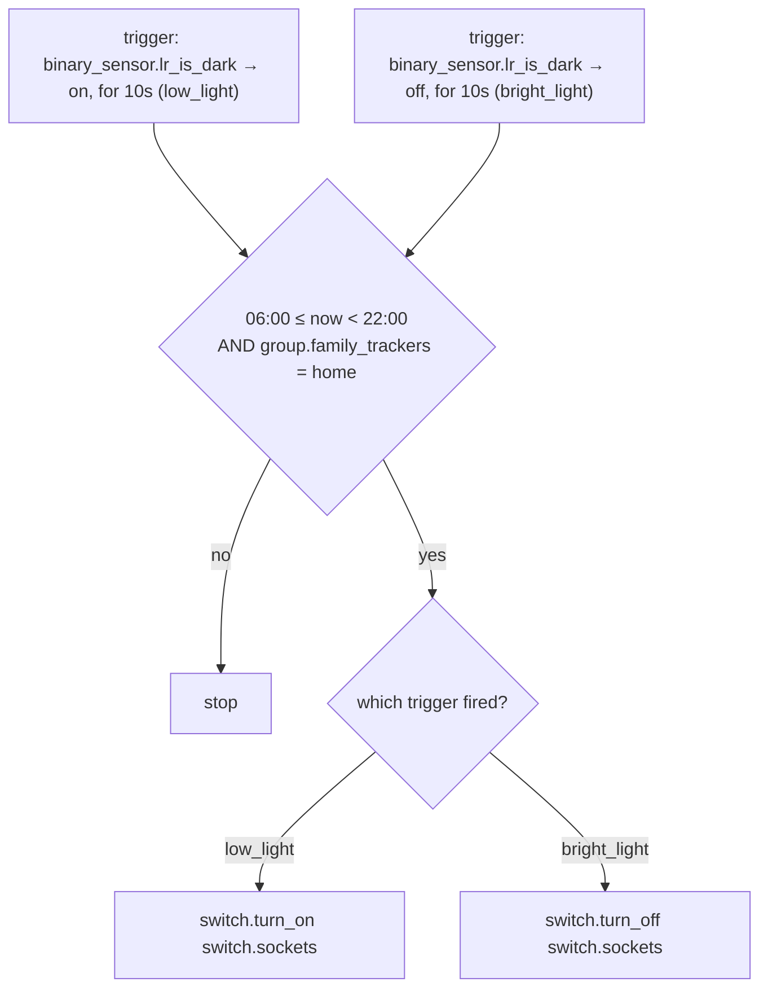

# Illuminance — Automations

Source: [`packages/illuminance.yaml`](../../packages/illuminance.yaml)

## Sockets: Illuminance Control

Turns the `switch.sockets` group (MB, LR, Abi, and Yard lamp sockets) on when
it's dark and off when it's bright, gated to daytime hours and to whether
the family is home.

### Caveats / recommendations

- **Single sensor drives four rooms.** The gate is `binary_sensor.lr_is_dark`
  only — MB, Abi, and Yard sockets follow the living room's light level, not
  their own. If LR gets bright while MB/Abi are still dark (or vice versa),
  all sockets switch together anyway. This is a known trade-off shared with
  the Kitchen/Abi `Auto Scene` automations, which depend on
  `kitchen_is_dark`/`abi_is_dark` — sensors defined in `light_sensing.yaml`
  that share the `lux_is_dark` macro with `lr_is_dark`/`mb_is_dark`, fed
  LR's/MB's lux sensor as input — in lieu of a per-room sensor.
- **No action outside 06:00–22:00.** After 22:00 sockets won't auto-turn-on
  even if dark — by design, [`schedule.yaml`](../../packages/schedule.yaml)'s
  10pm shutoff and [`night_walk.yaml`](../../packages/night_walk.yaml) own
  the late-night behavior instead. Worth remembering if this automation
  ever seems "unresponsive" late at night.
- **Family-away means no response to darkness at all**, even during the
  06:00–22:00 window — sockets stay in whatever state they were left in.
