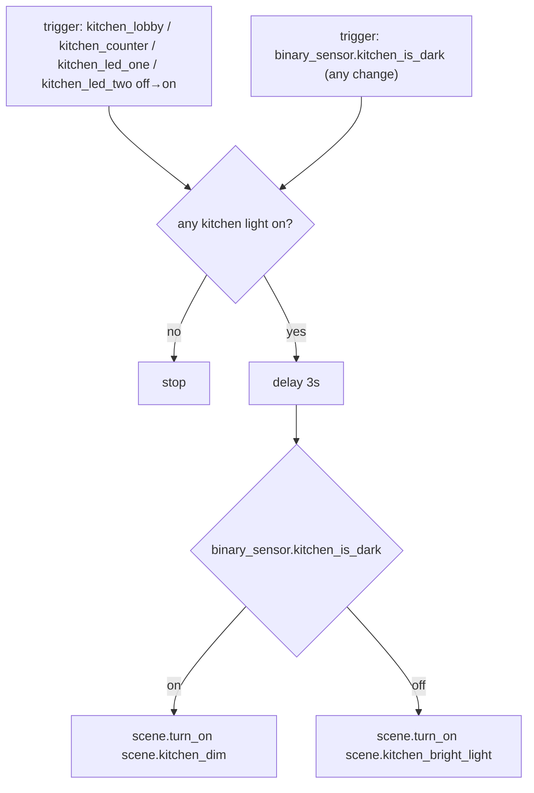

# Kitchen — Automations

Source: [`packages/kitchen.yaml`](../../packages/kitchen.yaml)

## Kitchen: Auto Scene

Applies Bright Light or Dim when a Kitchen light turns on, or when ambient
light crosses the `is_dark` hysteresis band. Kitchen has no illuminance
sensor of its own, so `binary_sensor.kitchen_is_dark` (defined in
[`light_sensing.yaml`](../../packages/light_sensing.yaml)) computes its own
hysteresis via the shared
[`lux_is_dark` macro](README.md#shared-is_dark-macro), fed LR's lux sensor
as input — see caveats.

Instance of the [Auto Scene blueprint](README.md#auto-scene-blueprint),
with `tv_players` left empty (Kitchen has no TV) — `packages/kitchen.yaml`
only supplies inputs, not the automation logic.

### Caveats

- **`binary_sensor.kitchen_is_dark` computes its own state from LR's lux
  reading — it's not an independent measurement.** It shares the
  [`lux_is_dark` macro](README.md#shared-is_dark-macro) with LR's, MB's,
  and Abi's `is_dark` sensors, called with
  `sensor.lr_light_sensor_illuminance` as input since Kitchen has no
  illuminance sensor of its own. The underlying light-level-divergence risk
  is unchanged from before this was named/shared: if Kitchen and LR ever
  diverge in natural light (e.g. Kitchen gets direct afternoon sun that LR
  doesn't), the scene applied to Kitchen still reflects LR's actual light
  level.
- **No TV Scene equivalent** — Kitchen has no `media_player`, so there's no
  Redish-on-TV-on automation here, unlike LR/MB.
- Same 3s-delay / undebounced-`is_dark` notes as
  [`LR: Auto Scene`](living_room.md#lr-auto-scene) apply here.

### Recommendations

- Add a dedicated Kitchen illuminance sensor to remove the LR-borrowing
  above. Swapping it in is a one-line change to the `lux_is_dark` macro
  call's first argument in `light_sensing.yaml` — no automation edits
  needed.
