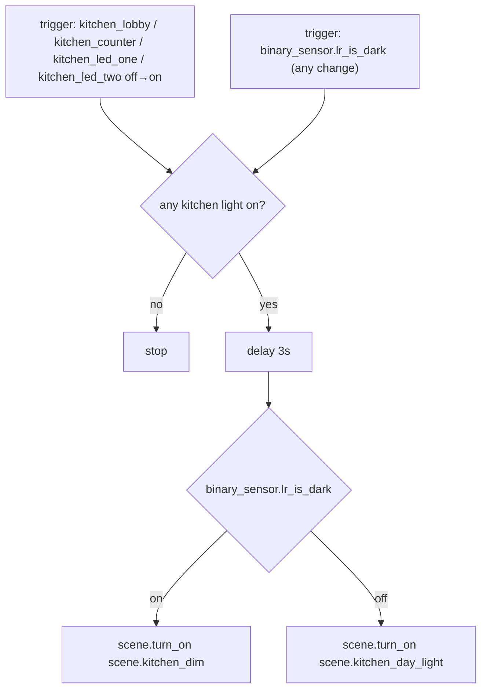

# Kitchen — Automations

Source: [`packages/kitchen.yaml`](../../packages/kitchen.yaml)

## Kitchen: Auto Scene

Applies Day Light or Dim when a Kitchen light turns on, or when ambient
light crosses the `is_dark` hysteresis band. Kitchen has no illuminance
sensor of its own, so this shares LR's (`binary_sensor.lr_is_dark`) — see
caveats.

### Caveats / recommendations

- **Borrows LR's lux sensor.** Kitchen has no illuminance sensor of its
  own, so `binary_sensor.lr_is_dark` stands in as a proxy. If the two rooms
  ever diverge in natural light (e.g. Kitchen gets direct afternoon sun
  that LR doesn't), the scene applied to Kitchen will reflect LR's light
  level, not Kitchen's actual light level. A dedicated Kitchen lux sensor
  (mirroring `sensor.lr_light_sensor_illuminance` /
  `binary_sensor.lr_is_dark` in [`light_sensing.yaml`](../../packages/light_sensing.yaml))
  would remove this coupling.
- **No TV Scene equivalent** — Kitchen has no `media_player`, so there's no
  Redish-on-TV-on automation here, unlike LR/MB.
- Same 3s-delay / undebounced-`is_dark` notes as
  [`LR: Auto Scene`](living_room.md#lr-auto-scene) apply here.
