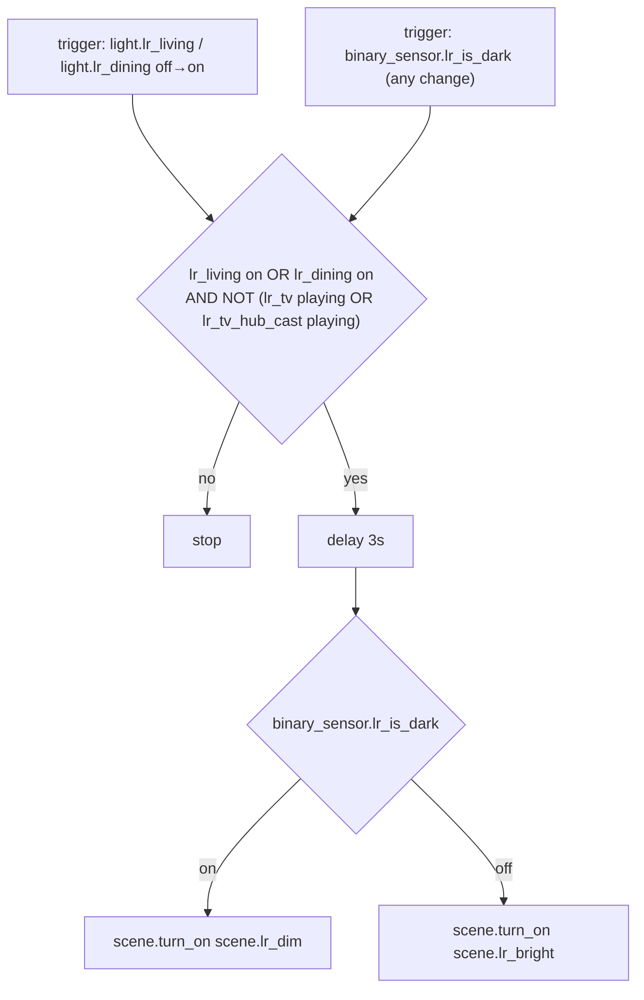
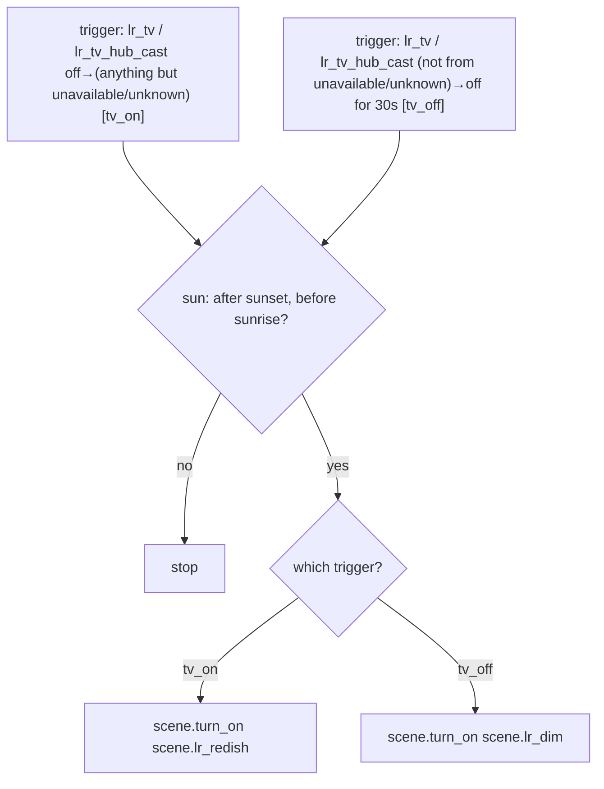

# Living Room — Automations

Source: [`packages/living_room.yaml`](../../packages/living_room.yaml)

## LR: Auto Scene

Applies Bright or Dim when an LR light turns on, or when ambient light
crosses the `is_dark` hysteresis band — but only while the TV isn't playing,
so `LR: TV Scene` keeps control during playback.

Instance of the [Auto Scene blueprint](README.md#auto-scene-blueprint) —
`packages/living_room.yaml` only supplies inputs, not the automation logic.

### Caveats

- **The 3s delay is now a named, configurable blueprint input** (`delay` in
  [`terminus/auto_scene.yaml`](../../blueprints/automation/terminus/auto_scene.yaml)),
  not a bare hardcoded number — but it's still a race-avoidance wait, not a
  true debounce: if `is_dark` flips again inside that window, the scene
  applied may not match the sensor's final state. No visible symptoms
  currently, but worth knowing if scene mismatches with reality are ever
  reported.
- **`is_dark` has no built-in debounce** on this trigger (unlike
  [`illuminance.yaml`](illuminance.md)'s `for: 10s`), so brief lux flicker
  during transitional weather can cause the scene to reapply more often than
  necessary. Harmless (scene.turn_on is idempotent) but worth knowing if
  automation traces look noisy.

## LR: TV Scene

Applies Redish when the TV turns on, or Dim when it turns off for 30s —
only between sunset and sunrise, no other time restriction.

Instance of the [TV Scene blueprint](README.md#tv-scene-blueprint) —
`packages/living_room.yaml` only supplies inputs, not the automation logic.

### Caveats

- **Daytime TV on/off never changes the scene** — by design (LR: Auto Scene
  handles daytime light instead), but worth remembering when testing during
  the day: nothing will visibly happen.
