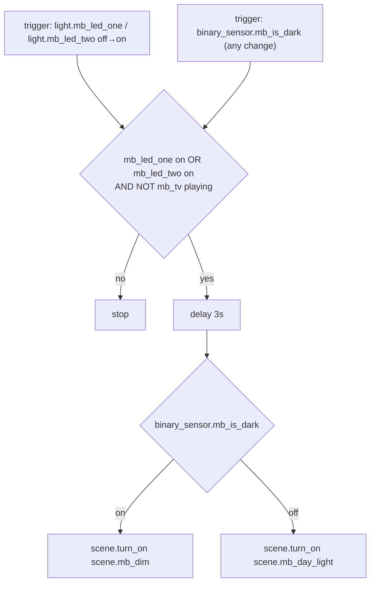
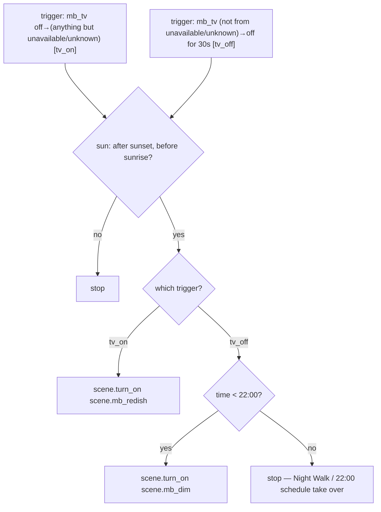

# Master Bedroom — Automations

Source: [`packages/master_bedroom.yaml`](../../packages/master_bedroom.yaml)

## MB: Auto Scene

Same pattern as `LR: Auto Scene`, applied to `light.mb_led_one` /
`light.mb_led_two` and gated on `media_player.mb_tv` (a single entity,
unlike LR's two media players).

Instance of the [Auto Scene blueprint](README.md#auto-scene-blueprint) —
`packages/master_bedroom.yaml` only supplies inputs, not the automation
logic.

### Caveats

- Same 3s-delay and undebounced-`is_dark` notes as
  [`LR: Auto Scene`](living_room.md#lr-auto-scene) apply here.
- `light.mb_led_one` and `light.mb_led_two` are the only two lights checked
  in the OR condition — if the room ever gains a third light fixture, this
  automation and its scenes both need updating together.

## MB: TV Scene

Same pattern as `LR: TV Scene`, gated on `media_player.mb_tv`.

Instance of the [TV Scene blueprint](README.md#tv-scene-blueprint) —
`packages/master_bedroom.yaml` only supplies inputs, not the automation
logic.

### Caveats

- Single `media_player.mb_tv` entity — if MB ever adds a cast target like
  LR's `lr_tv_hub_cast`, the blueprint's `tv_players` input here needs to
  grow to match, or TV-on events routed through the second player will be
  silently ignored.
