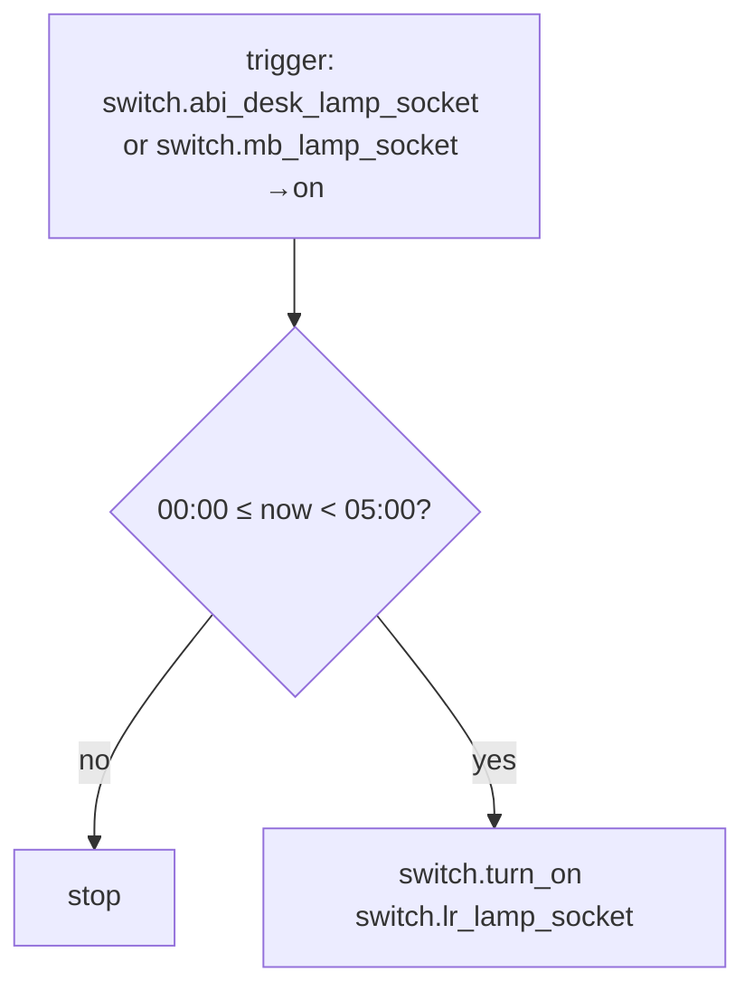
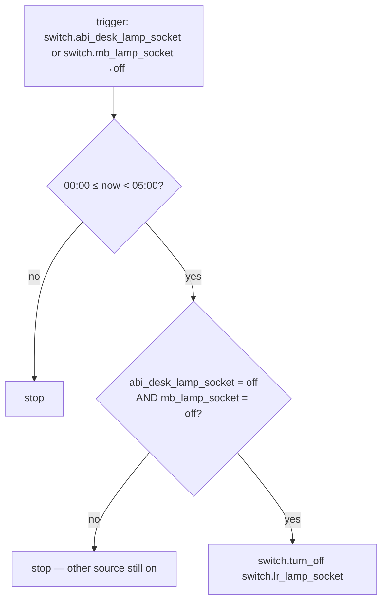

# Night Walk — Automations

Source: [`packages/night_walk.yaml`](../../packages/night_walk.yaml)

## Night Walk

Between midnight and 5am, turning on either the Abi or MB lamp socket also
turns on the LR lamp socket — lighting a path through the living room.

### Caveats / recommendations

- Kitchen is not part of this hallway route — no kitchen lamp/socket
  participates in Night Walk. Reasonable if Kitchen isn't on the path
  between bedrooms, but worth confirming that's still true if the house
  layout or usage pattern changes.

## Night Walk: Off

Turns the LR lamp back off once *both* source sockets (Abi + MB) are off,
so LR doesn't go dark while one of the two rooms is still using the
hallway light.

### Caveats / recommendations

- **Correctly avoids the "one-off-kills-both" bug** that a naive mirror
  of `Night Walk` would have — the template condition re-checks both
  switches' current state rather than trusting which one fired the
  trigger. Nothing to fix here; noting it because this is the one
  automation in the repo where getting that logic wrong would be an easy
  mistake.
- Both automations share the same `00:00–05:00` window as a hardcoded time
  condition rather than deriving it from sun/schedule state — consistent
  with the "no lux sensor for hallway logic" design, but means the window
  itself needs a manual edit if sleep schedules change.
