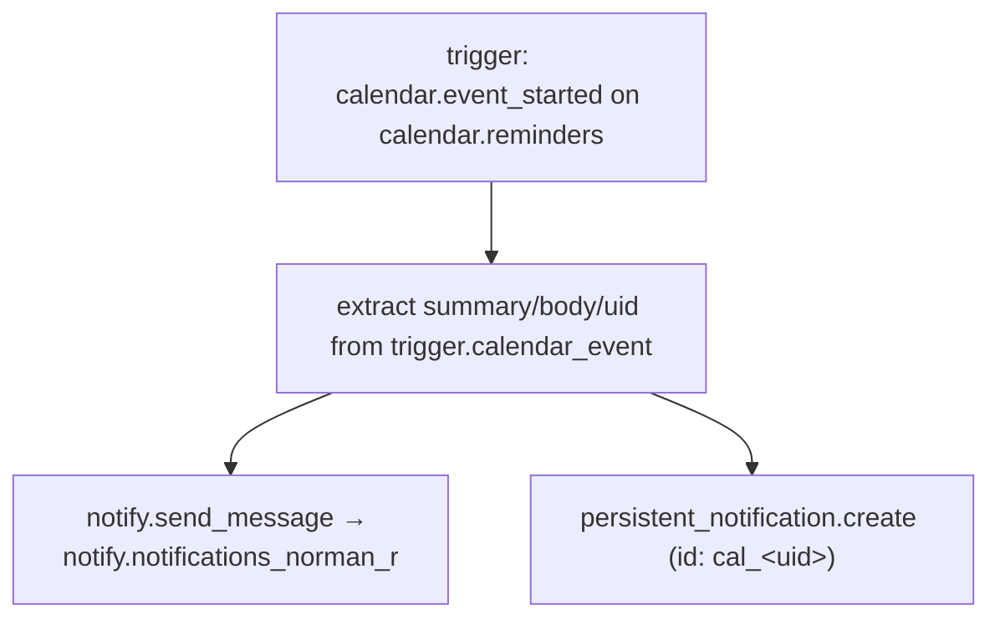
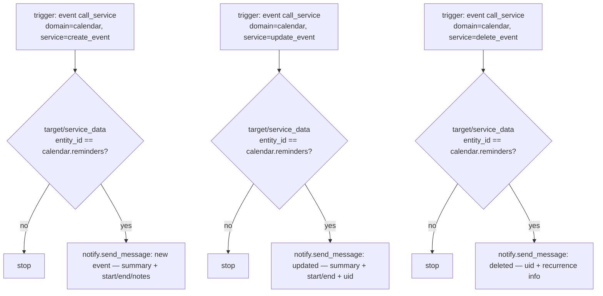
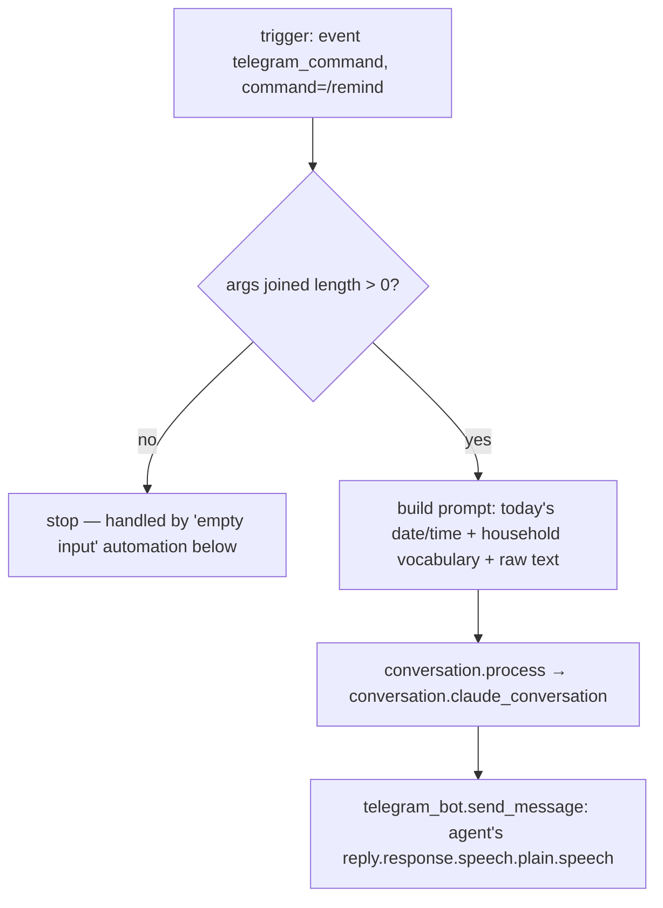
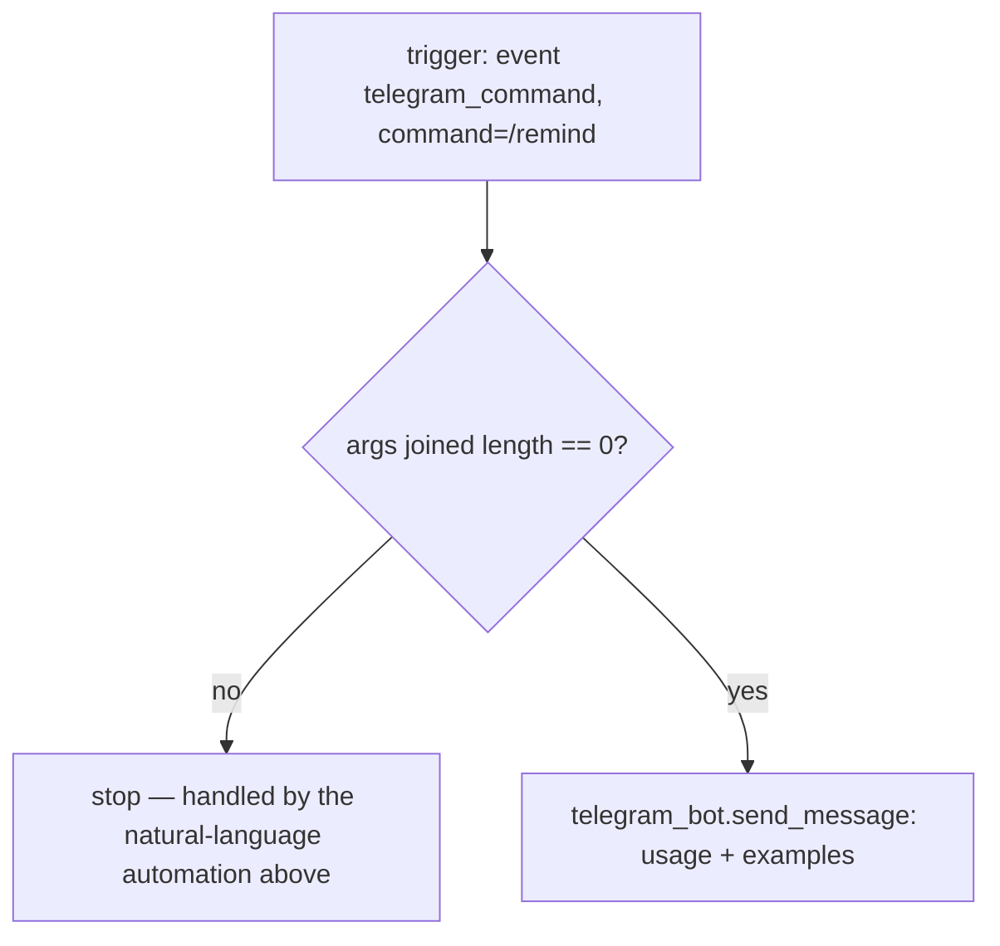

# Notifications — Automations

Source: [`packages/notifications.yaml`](../../packages/notifications.yaml)

## Notify: calendar reminder fires

Sends a mobile push + persistent notification when a `calendar.reminders`
event starts.

### Caveats

- Only notifies `notify.notifications_norman_r` — Nani has no mobile_app
  target wired in here, unlike the shared presence/lighting automations.
  Intentional if reminders are Norman-only, but worth confirming.
- `mode: parallel, max: 10` allows up to 10 concurrent reminder-start
  events; fine for normal use, but if many reminders fire in the same
  instant (e.g. a bulk calendar import), older duplicate `persistent_notification`
  IDs (`cal_<uid>`) could be overwritten out of order — low risk in practice.

## Notify: calendar event created / updated / deleted

Three near-identical automations that listen for the *service call event*
(`call_service`) for `calendar.create_event` / `update_event` /
`delete_event`, filter to `calendar.reminders`, and push a Telegram-style
notification describing the change.

### Caveats

- **Relies on the internal `call_service` event bus**, which is a legacy/
  internal HA mechanism, not a documented stable API — a future HA core
  change to how service calls are dispatched (or a switch to `action`-based
  internals) could silently break all three of these without any error
  surfacing. This is the most fragile dependency in the notifications
  package.
- The `entity_id` filter checks both `service_data.entity_id` and
  `target.entity_id` — necessary because callers can address the service
  either way, but it means any future third calling convention (e.g. nested
  `target.area_id` resolving to the calendar) would silently bypass the
  filter and fail to match.
- No dedup — if the same create/update call is retried by the caller (e.g.
  a flaky client retry), duplicate notifications would be sent.

### Recommendations

- If calendar entity state ever exposes create/update/delete events
  directly, migrate these three automations to that instead of the
  internal `call_service` event bus — it would be more future-proof.

## Telegram: /remind natural language → Claude

Forwards free-text after `/remind` to the Claude conversation agent, which
creates the calendar event via Assist tools, then relays the confirmation
back over Telegram.

### Caveats

- **Hard dependency on an external LLM call** (`conversation.claude_conversation`)
  with no fallback or error branch — if the Anthropic API is down, rate
  limited, or the conversation agent is misconfigured, `reply.response...`
  will fail to resolve and the whole automation errors out with no
  Telegram reply sent to the user at all (they'll just see silence).
- The prompt hardcodes "Nanis"/"Abi"/"Abril" household vocabulary inline —
  if that mapping needs to change, it only lives in this one template
  string, not any shared config.
- `mode: parallel, max: 5` — five concurrent `/remind` calls could all hit
  the LLM simultaneously; not a problem functionally, but worth knowing if
  Anthropic API costs/rate limits ever become a concern under bursty usage.

### Recommendations

- Add a `continue_on_error` + fallback "couldn't process that, try again"
  Telegram message on the `conversation.process` step, so an LLM failure
  doesn't leave the user staring at silence.

## Telegram: /remind empty input → usage

Companion to the automation above — replies with a usage hint when
`/remind` is sent with no arguments.

### Caveats

- This and the natural-language automation both trigger on the exact same
  event and are mutually exclusive only via their opposite length
  conditions — correct today, but fragile if the set of `/remind` handlers
  ever grows.

### Recommendations

- Any future `/remind`-triggered automation must repeat this same length
  check pattern rather than assuming these two conditions are exhaustive of
  all possible states (e.g. `args` being undefined rather than empty).
