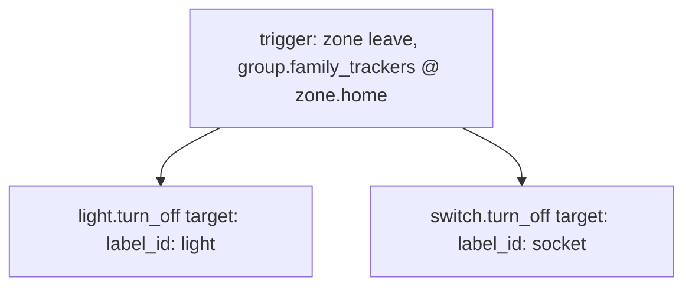
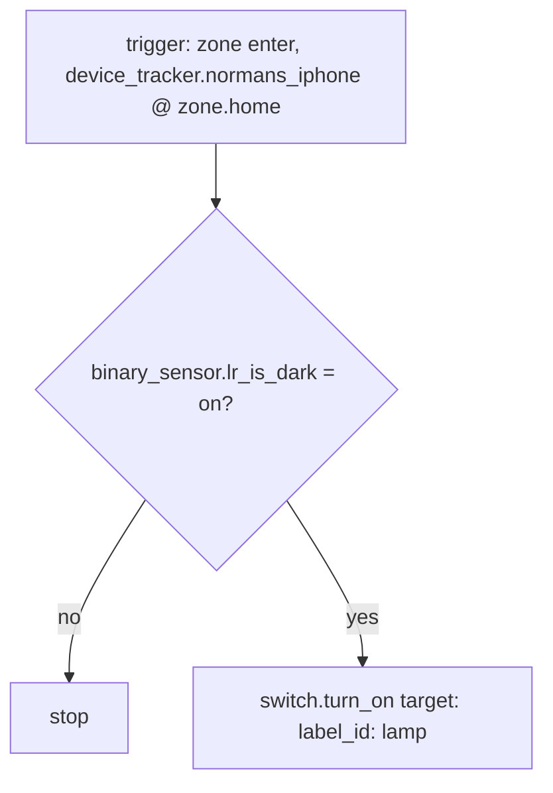

# Presence — Automations

Source: [`packages/presence.yaml`](../../packages/presence.yaml)

## Turn off lights when everyone leaves

Fires off `group.family_trackers` (Norman + Nani's iPhones) leaving the
`zone.home` zone — a group zone trigger fires only once every member has
left.

### Caveats

- Same label-dependency caveat as
  [`schedule.yaml`'s 10pm shutoff](schedule.md#caveats) — relies on the
  `light` / `socket` labels being correctly assigned.
- **No time-of-day or `is_dark` gate** — if everyone leaves mid-morning
  with lights on, they turn off immediately regardless of context. This is
  presumably intended (nobody home → no need for lights) but is worth
  flagging since none of the light-domain automations elsewhere in this
  repo skip a condition check like this.

## Turn on the lights when someone gets home

Fires only on `device_tracker.normans_iphone` entering `zone.home`, and only
turns lamps on if it's currently dark.

### Caveats

- **Only Norman's phone triggers this** — `device_tracker.nanis_iphone` is
  a member of `group.family_trackers` (used by the "leave" automation
  above) but is not wired into this "arrive" trigger. If Nani gets home
  alone after dark, no lamps turn on.
- Uses `binary_sensor.lr_is_dark` as the darkness gate — same
  single-sensor-drives-everything caveat noted in
  [`illuminance.yaml`](illuminance.md#caveats).

### Recommendations

- Add `nanis_iphone` to the trigger `entity_id` list, or switch to
  `group.family_trackers` with an `enter` zone event, to match the
  symmetry of the "leave" automation and cover Nani arriving home alone.
