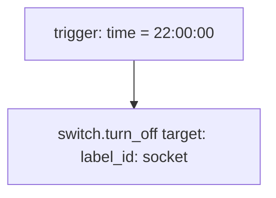

# Schedule — Automations

Source: [`packages/schedule.yaml`](../../packages/schedule.yaml)

## Turn off the lamps at 10pm

A fixed-time shutoff for every switch carrying the `socket` label. Scoped
to sockets/lamps only, so it can't interfere with
[`LR: TV Scene`](living_room.md#lr-tv-scene) /
[`MB: TV Scene`](master_bedroom.md#mb-tv-scene), which control `light.*`
LEDs directly.

### Caveats

- **Depends entirely on label assignment.** Any socket not tagged with the
  `socket` label (in the HA label registry, not this repo) is silently
  skipped — this automation has no allowlist of entity IDs to cross-check
  against, so a mislabeled or unlabeled new device won't be caught by
  reading this YAML alone.
- **Unconditional** — fires every day at 22:00 regardless of presence or
  current switch state. Harmless when switches are already off, but means
  this automation can't be used as a signal for "were the lamps on at
  10pm" in traces.
- No DST handling needed (per repo's Costa Rica / no-DST note in
  `CLAUDE.md`), so the fixed `22:00:00` trigger never needs seasonal
  adjustment.

### Recommendations

- Periodically check `light`/`socket` label membership via the UI or
  `hass-cli`, since a mislabeled or unlabeled new device is otherwise
  invisible from this YAML alone.
