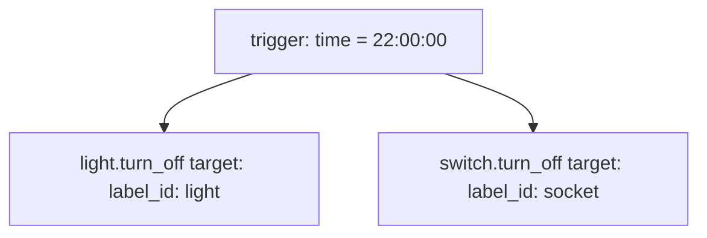

# Schedule — Automations

Source: [`packages/schedule.yaml`](../../packages/schedule.yaml)

## Turn off the lights at 10pm

A fixed-time shutoff for every light and socket carrying the `light` /
`socket` label, respectively.

### Caveats / recommendations

- **Depends entirely on label assignment.** Any light or socket not tagged
  with the `light`/`socket` label (in the HA label registry, not this repo)
  is silently skipped — this automation has no allowlist of entity IDs to
  cross-check against, so a mislabeled or unlabeled new device won't be
  caught by reading this YAML alone. Worth a periodic check of label
  membership via the UI or `hass-cli`.
- **Unconditional** — fires every day at 22:00 regardless of presence or
  current light state. Harmless when lights are already off, but means
  this automation can't be used as a signal for "were the lights on at
  10pm" in traces.
- No DST handling needed (per repo's Costa Rica / no-DST note in
  `CLAUDE.md`), so the fixed `22:00:00` trigger never needs seasonal
  adjustment.
